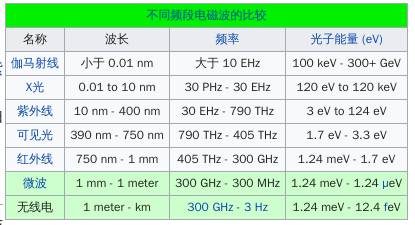
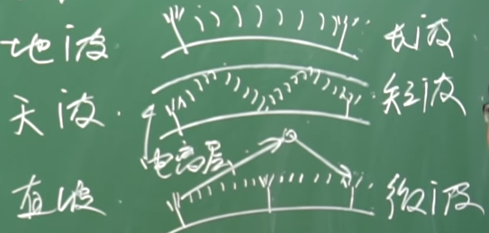

# 电磁波

电磁波，是指同相振荡，且互相垂直的电场与磁场，在空间中以波的形式传递能量和动量，其传播方向垂直于电场与磁场的振荡方向。

电磁波不需要依靠介质进行传播，在真空中其传播速度为光速

真空中波速为3x10^8, 等于波长x频率

电话, 光, 蜂窝网络(3G, 4G...), wifi(IEEE 802.11), 电视, 蓝牙, 微波炉这些全是电磁波

## 分类

gamma射线, 波长最小, 频率最大, 穿透性很强, 可以放射性疗法，杀死致病细胞， 绿巨人
    波长 < 0.01A(1A == 10^-12m)
    原子核激发产生
X射线(伦琴射线, 0.2A~20A), 透视, 安检
    原子内层电子激发
光(紫外线, 可见光(400nm-760nm), 红外线)
    原子外层电子激发
无线电(微波, 短波, 中波, 长波), 通讯, 波长大, 频率小
    电子周期性运动
    wifi应该属于微波, 2.4GHz的频带是2.4GHz~2.5GHz

## FM, AM

低频信号（声音等）传不远, 所以要将低频“调制”成高频信号

有两种方式, AM(调幅，将高低频直接的振幅组合，仍然是高频)， FM（调频，将频率组合）

## 电磁波传输的方式

- 地波: 长波，贴地传输
- 天波：短波，向上传到大气层中的电离层，反射回地面，再反射上去，如此往复
- 直线波: 既不能用地波传输又不能用天波传输，远距离传输使用中继(卫星是中继的一种)

汽车上的切频道就是通过切换汽车上的接收器的电容从而修改能接受到其他频率的电磁波
