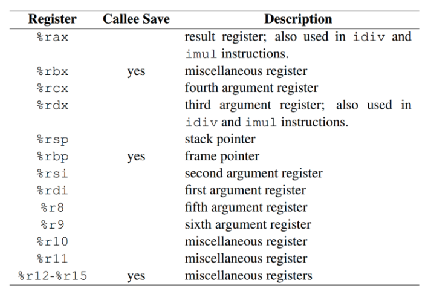
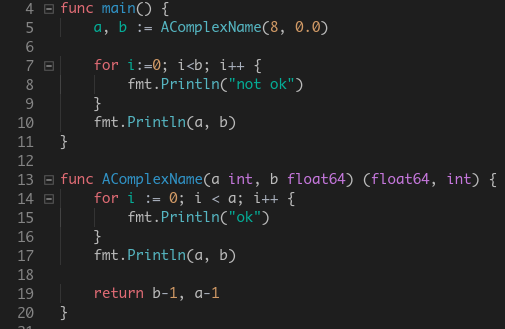
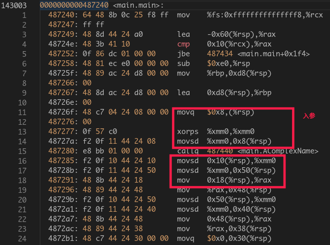
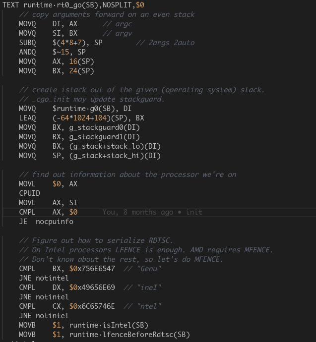
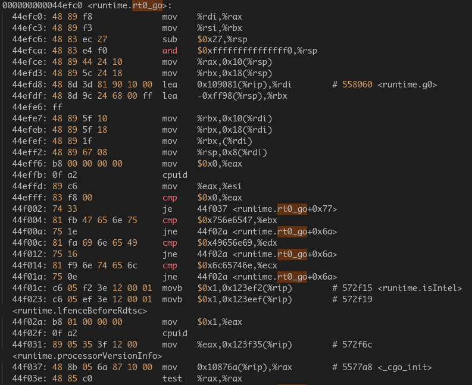

# register

## x86-64

这并不是强制的, 只是一个规范, windows和linux就不同

64位windows通过rcx, rdx, r8, r9传递前4个参数, 通过栈传递第5个开始的参数, 通过eax寄存器传递返回值.
64位linux, unix通过rdi, rsi, rdx, rcx, r8, r9传递前6个参数, 通过栈传递第7个开始的参数, 通过eax寄存器传递返回值.
go就不同, go的参数和返回值都是通过栈来传递, 所以go可以支持任意多的返回值, 没有单个eax寄存器导致的单返回值限制, 如果返回值或参数是struct, 其每个成员都会传, 见下图:

[source](https://studygolang.com/articles/11627)

x86-64指令一般目标在右, 比如mov %xmm0, 0x8(%rsp) 是把xmm0寄存器里的值放进内存中rsp+8这个位置

golang代码里的汇编和真正的汇编不同, go编译器会把其对应到对应的机器指令, 用objdump明显能看出区别, 但指令大体是一一对应的

