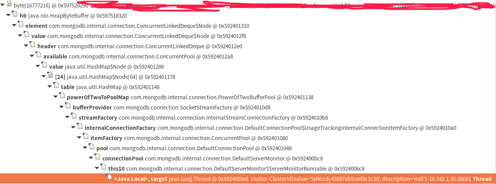

# 调优总结

## 线上机器jvm进程内存泄漏

这个程序的主要工作是定时调用一个接口，然后写mysql和mongodb, 程序的初始版本不是我写的, 而且不是我维护的

之前查看代码, 没发现哪里内存泄漏

运行一阵发现进程RSS逐渐增长，最后oom.
这个问题一直存在, 不过最近才关注, 查看发现此进程RSS才占用2G左右空间, 虚拟内存倒是用了40+G

### 步骤

1. jmap -heap $pid

    查看异常的heap情况，发现总共占用空间不到2G, 好像不至于oom, 机器有百G内存

2. pmap -x $pid

    查看进程地址空间情况

    没有什么帮助

3. jmap -dump:format=b,file=... $pid

    导出进程的堆

    随后用visualvm加载, 查看，没什么发现

4. 晚上得知服务当日刚好重启, 难怪占用内存不多, 于是打算第二天再看看

5. 第二天发现占用RSS增长了1G, 再dump了一份内存, 使用eclipse memory analyser和昨日的进行对比，发现byte[]增长了1G，其他对象最多只增长300k, 于是怀疑是byte[]发生了泄漏, 发现大byte[]很多, 一些甚至达到了16M, 看其内容不像字符串, 选了最大的一个看gc root, 情况如下:
   

6. 怀疑和mongo driver有关(这个推论不是确定的), 看了看和mongo相关的代码, 发现每次写mongo都会调用com.mongodb.client.MongoClients.create创建一个mongo client, 用完即弃，也没close
    作者本意应该是想创建一次赋给一个静态变量, 写了个三元运算符判断这个静态变量是否是null, 如果不是直接使用, 如果是则创建, 但作者忘了给这个静态变量赋值...
    只是初步怀疑是这个问题, 还需要进一步确认为啥整个过程会内存泄漏，毕竟这个变量会被gc, 其所引用的变量应该都会被回收，除非其内部放了数据到某个static队列之类的

7. 跟随调用链一路往下
   - com.mongodb.client.MongoClients.create(一堆重载)
   - com.mongodb.client.internal.MongoClientImpl.new
   - com.mongodb.client.internal.MongoClientImpl.createCluster
   - com.mongodb.connection.DefaultClusterFactory.create
   - com.mongodb.internal.connection.SingleServerCluster.new
   - com.mongodb.internal.connection.BaseCluster.createServer
   - com.mongodb.internal.connection.DefaultClusterableServerFactory.create
     发现这里建了个连接池ConnectionPool和ServerMonitorFactory
   - com.mongodb.internal.connection.DefaultServer.new
   - com.mongodb.internal.connection.DefaultServerMonitorFactory.create
   - com.mongodb.internal.connection.DefaultServerMonitor.new
     这里发现新建了个定时监视mongo服务器的线程, 且这个线程能访问ConnectionPool这个对象, 导致这个对象是个gcroot, 所以未被回收, 自此破案

### 结论

- 第一次了解pmap这个好东西, 可以看进程的堆栈地址, 虽然这次没起到什么大作用
- eclipse memory analyser 是好东西, 看gcroot和多个heap dump对比太有用了
- mongo driver所有参数基本都用final修饰了, 是个好操作, kotlin对参数强制用final也是有理的
- 用简单的semaphore就能实现最大大小的池，之前想复杂了
- 编码需仔细
