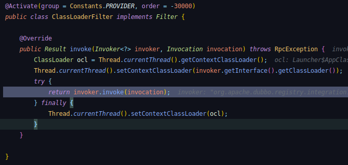

# java classloader

## 类别

- 引导类加载器（bootstrap class loader）：它用来加载 Java 的核心库，是用原生代码来实现的，并不继承自 java.lang.ClassLoader。
- 扩展类加载器（extensions class loader）：它用来加载 Java 的扩展库。Java 虚拟机的实现会提供一个扩展库目录。该类加载器在此目录里面查找并加载 Java 类。
- 系统类加载器（system class loader）：它根据 Java 应用的类路径（CLASSPATH）来加载 Java 类。一般来说，Java 应用的类都是由它来完成加载的。可以通过 ClassLoader.getSystemClassLoader()来获取它。

## 实例

图里设置了当前线程的 contextClassLoader 使得接口的声明和实现是一个类加载器加载的
