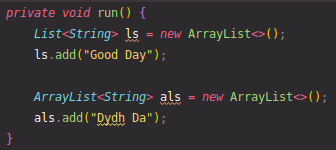

# invoke*

## invokespecial

进行非虚(精确)分派时使用

## difference between invokevirtual and invokeinterface

初看这两者貌似相同, 细看能考虑到对于virtual table的方法查找实现,
invokevirtual能在编译时确定调用方法的在virtual table中指向的位置,
而invokeinterface不能

一个常用的优化是子类virtual method table继承自父类, 只是最后添加了些条目, 所以
编译器优化可以根据方法的调用确定这个方法在表中的位置. 这是invokevirtual可进行的优化

但invokeinterface不能这样进行, 即使interface有虚方法表, 类可以实现多个interface,
所以根本没法根据方法在interface的位置确定方法在子类的位置

see [what is the point of invoke interface](https://stackoverflow.com/questions/1504633/what-is-the-point-of-invokeinterface)

这个例子中, `ls.add`会使用invokeinterface, `als.add`会使用invokevirtual
