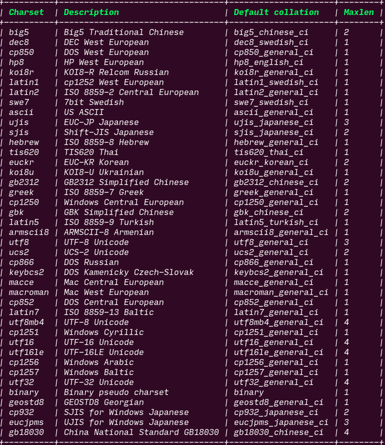
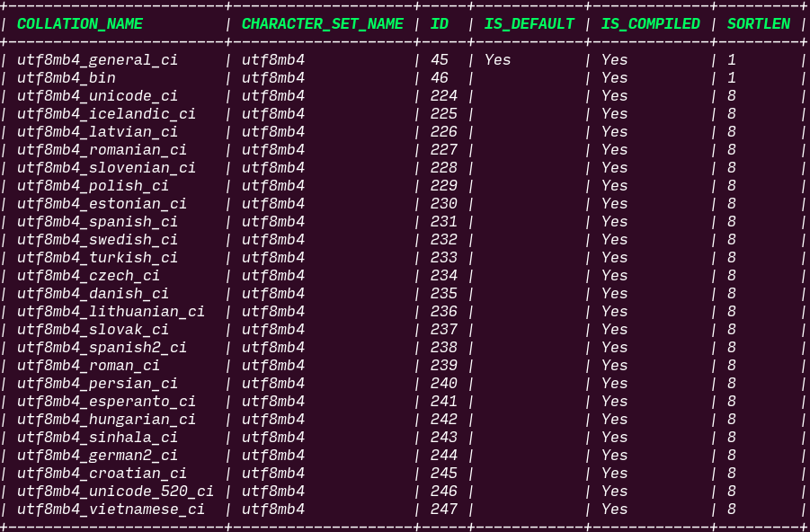

# mysql character set

## character set(字符的表示)

- mysql中utf8最多占用3字节, 只包含基本多文本平面的字符; utf8mb4最多占用4字节, mb4表示most bytes 4
- [mysql中utf8和utf8mb4区别](http://ourmysql.com/archives/1402)

## collation(字符的排序规则)

- ci 表示case insensitive
- [再见乱码：5分钟读懂MySQL字符集设置](https://www.cnblogs.com/chyingp/p/mysql-character-set-collation.html)

## case sensitive string compare

See [this](https://stackoverflow.com/questions/5629111/how-can-i-make-sql-case-sensitive-string-comparison-on-mysql) problem.
Basiclly, use `SELECT *  FROM table WHERE BINARY column = 'value'`.
