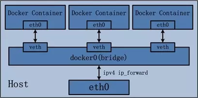

# network bridge

Layer two device, a better approach compare to hub, but not as better as a switch.

Basiclly, these three device do the same job, construct a LAN network.
不同于hub, 网桥可以分割冲突域以提升效率. 一般是将一个LAN分割为两个冲突域.
switch高级在其可以切分任意个冲突域, 使得每个主机一个冲突域.

## linux network bridge

linux中的一个抽象概念, 将物理网桥抽象为一种内置设备, 软件实现.
将一个网卡"接入"网桥(相当于用RJ45将一个真实网卡与真实网桥的一个口相连), 通过将此网卡的master设置为这个bridge.

将network namespace想象为一台独立的主机(有独立的协议栈), 通过host上的网桥, 可以将多个network namespace连接起来(相当于使用交换机或网桥将多个主机连接起来)

linux 网桥也可以工作在三层, 转发ip包.

[Linux虚拟网络设备之bridge(桥)](https://segmentfault.com/a/1190000009491002)

### docker network

docker network 默认是网桥模式, 且将网桥当三层设备使用, 需要宿主机开启ip_forward.
容器内的包走默认路由, 从eth0出, 从网桥的veth入, host检测到ip地址不是local ip, 进行转发.

## linux veth

相当于一对虚拟网卡.

[Linux虚拟网络设备之veth](https://segmentfault.com/a/1190000009251098)