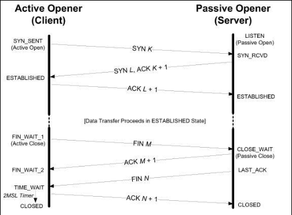

# tcp 实验

## 连接建立后，一端close只会发生fin，对方回ack，对方除非调用close，否则连接不会彻底关闭。

## SOL_SOCKET

表示这个socket选项是socket层级的（socket通用的），比如SO_REUSEADDR

## 关于time_wait

主动关闭连接的一端进入time_wait应该是这个socket pair（即源ip，源port，目的ip，目的port四元祖）进入time_wait.
但BSD衍生系统往往更严格，使得这个端口不可用, 这可以通过SO_REUSEADDR选项控制.
但无论如何，tcp规定这四元组在time_wait期间不可再次出现。但Linux上，这似乎可以再次出现，(需要进一步验证)
time_wait的目的是防止老的tcp segment被解释成新的segment，linux上由于ISN是递增的，只要老的最后一个段的seq小于新连接的ISN，就不会导致错误解释情况。

## 关于FIN_WAIT2

(在主动方调用close而不是half close)不会一直等到对方应用调用close，设置一个定时器，等一定时间后就将这个连接从FIN_WAIT2转入CLOSED状态，TCP/IP详解上说BSD衍生版是10分+75秒，但我的linux上测试是不超过3分钟。

## tcp_syn_retries

This flag controls how many times syn segment retries to establish connection.
When I change it by 1 on my archlinux, this doesn't work.
But when I change it on my ubuntu, this works.

First retry wait for 1s, the next wait for 2s, 4s. Use exponential backoff.