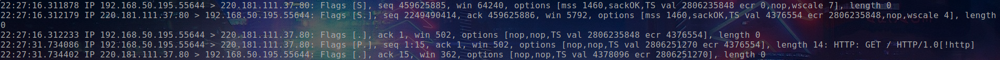

# tcp PSH flag

> When you send data, your TCP buffers it. So if you send a character it won't send it immediately but wait to see if you've got more. But maybe you want it to go straight on the wire: this is where the PUSH function comes in. If you PUSH data your TCP will immediately create a segment (or a few segments) and push them.
>
> But the story doesn't stop here. When the peer TCP receives the data, it will naturally buffer them it won't disturb the application for each and every byte. Here's where the PSH flag kicks in. If a receiving TCP sees the PSH flag it will immediately push the data to the application.
>
> The purpose of the PSH bit is to tell TCP that do not wait for the buffer to become full and send the data immediately. Similarly when the receiver receives the segment with PSH flag set, should send the data immediately to the upper layer without waiting for the receive buffer to become full. The practical example of this is the telnet application where the application sends data in the form of few keystrokes. The telnet will become unusable if it waits for the buffer to become full and then transits the data to the receiver.

Linux 系统中没有办法确定开启这个标志，man page也没有描述这个标记。亲测Linux中的telnet会设置这个标记，设置TCP_NODELAY应该会，下面是实验:

```python
from socket import *
s = socket()
s.setsockopt(SOL_TCP, TCP_NODELAY, 1)
s.connect(('www.baidu.com', 80))
s.send(b'GET / HTTP/1.0')       # 这里会设置
```



类似TCP_NODELAY的flag有TCP_CORK(man 7 tcp)和MSG_MORE(man 2 send)

## following links are quite useful

* [Difference between push and urgent flags in TCP](https://stackoverflow.com/questions/9153566/difference-between-push-and-urgent-flags-in-tcp)
* [when is the push flag set in tcp segment](https://stackoverflow.com/questions/2264154/when-is-the-push-flag-set-in-tcp-segment)