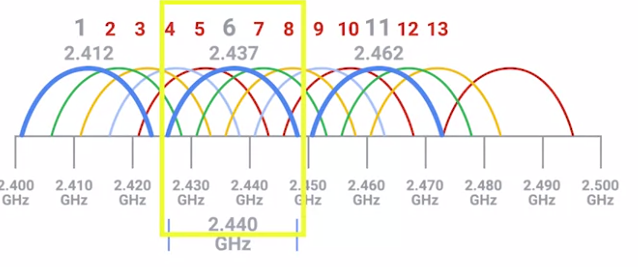

The many different 802.11 specifications -- most commonly b, a, g, n and ac -- all operate with the same basic data link protocol. But, how they operate at the physical layer varies. 

Memorizing all of these differences probably isn’t worth the time unless you’re going to be working with many different types of wireless networks all the time. The most important thing to remember is that networks that operate on the 5Ghz band are almost always faster, but have less of a range. Most of the 2.4Ghz networks are slightly slower and more susceptible to interference, but usually cover a larger area.
(5G速度更快，更不容易受影响，2.4G覆盖的范围更广)

2.4GHz指的实际上是频带范围在2.4GHz~2.5GHz的电磁波
其中又可以细分为多个channel

由于无线电波不精确，所以不同channel会发生重叠，但有些channel距离远到不可能重叠而发生冲突，比如channel1和channel6和channel11

蓝牙的频段是2.4GHz~2.485GHz，所以会和wifi信号冲突, 这就是为什么我的蓝牙耳机在工位上信号很糟糕, 也是为什么公司的网连起来速度很慢, 是因为我这块区域用路由器的人太多了, 都在很接近的频带，导致大量的冲突.
现在的无线设备基本都会自动感知拥塞的信道，从而自动选择合适的信道, 蓝牙也有自动跳频的能力. 这也是为什么之前配置多个access point同名时使用不同的channel

[wifi和蓝牙是否冲突 - 知乎](https://www.zhihu.com/question/26896447)

大多数通用的频段都是2.4GHz, 原因见[why everything wireless is 2.4GHz](https://www.wired.com/2010/09/wireless-explainer/), [中文版本](https://lcx.cc/post/4030/)

蜂窝网络的频段倒不是这些